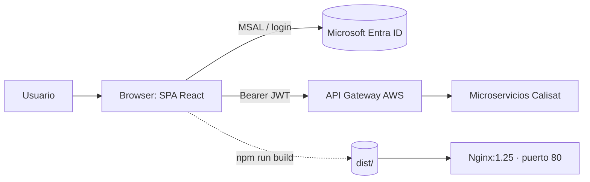

# calisat-frontend

> SPA de e‑commerce para equipamiento de calistenia: catálogo, carrito y perfil de usuario, con autenticación en Microsoft Entra ID (Azure AD) mediante MSAL.


**Versión actual: `1.4.0`** (definida en `package.json` · historial en [`CHANGELOG.md`](CHANGELOG.md))

---

## 📑 Índice

- [📋 Descripción general](#-descripción-general)
- [✨ Características principales](#-características-principales)
- [🏗️ Arquitectura](#-arquitectura)
- [🚀 Requisitos](#-requisitos)
- [⚙️ Configuración](#-configuración)
- [▶️ Ejecución local](#-ejecución-local)
- [📡 Endpoints y rutas principales](#-endpoints-y-rutas-principales)
- [🗃️ Modelo de datos](#-modelo-de-datos)
- [🔒 Seguridad](#-seguridad)
- [🧪 Tests](#-tests)
- [📦 Despliegue](#-despliegue)
- [🔗 Microservicios relacionados](#-microservicios-relacionados)
- [📄 Licencia y modo académico](#-licencia-y-modo-académico)

---

## 📋 Descripción general

**calisat-frontend** es la interfaz de usuario de la plataforma **Calisat**, construida como una aplicación de página única (SPA) con **React 19** y **Vite 8**. Permite explorar el catálogo de productos de calistenia, gestionar el carrito y el perfil del usuario, todo protegido con inicio de sesión en **Microsoft Entra ID (Azure AD)** a través de **MSAL** (`@azure/msal-react`).

La aplicación consume los microservicios del backend a través de un **API Gateway** de AWS (REST), enviando el token JWT obtenido en el inicio de sesión como cabecera `Authorization: Bearer`.

## ✨ Características principales

- 🛍️ **Catálogo paginado**: listado de productos con búsqueda rápida, filtro por categoría y detalle por SKU (`useProductos` + `catalogoService`).
- ✏️ **Gestión de productos**: crear, editar y eliminar productos (con diálogo de confirmación) cuando el usuario está autenticado.
- 🔐 **Autenticación con Entra ID**: flujo MSAL con `acquireTokenSilent`, *cache* en `sessionStorage* y *scopes* de API (`read-write`).
- 👤 **Sincronización de usuario**: al iniciar sesión, `useUserSync` registra automáticamente el perfil en `POST /api/v1/usuarios/registro`.
- 🧭 **Enrutamiento SPA**: rutas con `react-router-dom` 7 (`/`, `/productos`, `/carrito`, `/checkout`, `/perfil`).
- 🎨 **Sistema de diseño con Tailwind 4**: tokens de tema (`primary`, `accent`, `surface`, `text`, estados) definidos en `@theme` de `src/index.css`.
- 📱 **Navbar adaptable**: barra de navegación con estado de sesión y acceso al perfil (`Navbar`, `UserNavbar`, `UserProfile`).
- ⚡ **Build optimizado**: bundle Vite con *hash* de contenido, servido por nginx con Gzip, caché de `assets/` y *fallback* SPA.

## 🏗️ Arquitectura



### Estructura de proyecto

```
calisat-frontend/
├── index.html
├── nginx.conf              # Config del servidor de producción
├── Dockerfile              # Multi-stage: node:20 build → nginx runtime
├── package.json            # Versión 1.4.0
├── vite.config.js          # Plugins React + Tailwind, base '/'
└── src/
    ├── main.jsx            # Punto de entrada + proveedor MSAL
    ├── App.jsx             # Router (rutas de la SPA)
    ├── index.css           # Tokens del tema (Tailwind @theme)
    ├── auth/
    │   └── AuthConfig.js   # msalConfig, loginRequest, apiRequest
    ├── pages/
    │   ├── HomePage.jsx
    │   └── ProductosPage.jsx
    ├── components/
    │   ├── layout/         # Navbar, UserNavbar, UserProfile
    │   └── catalogo/       # ProductoCard, ProductoForm, ConfirmDialog
    ├── hooks/
    │   ├── useProductos.js
    │   ├── useUserProfile.js
    │   └── useUserSync.js
    └── services/
        └── catalogoService.js   # Cliente REST del catálogo
```

## 🚀 Requisitos

| Requisito | Versión mínima |
|-----------|----------------|
| Node.js | 20+ (recomendado 20 LTS, como en el `Dockerfile`) |
| npm | 9+ |
| Cuenta Microsoft Entra ID | Para autenticación (modo académico) |
| Docker (opcional) | 24+ · solo para despliegue contenedorizado |

## ⚙️ Configuración

| Parámetro | Valor | Definido en |
|-----------|-------|-------------|
| Puerto (desarrollo) | `5173` (por defecto de Vite) | — |
| Puerto (producción) | `80` (nginx) | `nginx.conf` |
| Base URL del API Gateway | `https://ho5p58iyu7.execute-api.us-east-1.amazonaws.com` | `src/config/api.js` |
| Client ID (MSAL) | `d221f0d2-1a7c-4872-ad6c-367a1f0717ec` | `src/auth/AuthConfig.js` |
| Tenant (autoridad) | `e5372bf0-c5e3-4286-887c-79069f209c1f` | `src/auth/AuthConfig.js` |
| *Redirect URI* | `https://ezeh839whh.execute-api.us-east-1.amazonaws.com/desarrrollo/` | `src/auth/AuthConfig.js` (+ registro en Entra ID) |
| *Post-logout redirect* | igual que el *redirect URI* | `src/auth/AuthConfig.js` |
| *Scope* de API | `api://d221f0d2-1a7c-4872-ad6c-367a1f0717ec/read-write` | `src/auth/AuthConfig.js` |
| *Cache* de MSAL | `sessionStorage` | fijo en `AuthConfig.js` |

> **Sin variables de entorno**: la SPA **no** lee el objeto de entorno de
> Vite ni archivos `.env` — toda la configuración va hardcodeada en los
> ficheros de la tabla. Si cambia el host del API Gateway, amplía también
> `connect-src` en `nginx.conf` (la CSP bloquea el fetch a orígenes no
> listados); si cambia el tenant o el origen desplegado, actualiza
> `AuthConfig.js` **y** el redirect URI registrado en Microsoft Entra ID.
>
> ⚠️ clientId/tenant/URL son **identificadores públicos** (viven en el
> JavaScript de producción). Nunca pongas aquí *client secrets*, API keys,
> tokens ni credenciales: en una SPA pública no existe ningún sitio seguro
> donde guardarlas.

## ▶️ Ejecución local

### 1. Dependencias

```bash
npm install
# o, para instalación reproducible:
npm ci
```

### 2. Servidor de desarrollo (Vite)

```bash
npm run dev
```

Abre `http://localhost:5173`. El *hot reload* está habilitado por defecto.

### 3. Build de producción

```bash
npm run build      # genera dist/
npm run preview    # previsualiza el build localmente
```

### 4. Lint

```bash
npm run lint
```

### 5. Docker (producción)

```bash
docker build -t calisat-frontend .
docker run -p 80:80 calisat-frontend
```

El `Dockerfile` es *multi-stage*: `node:20-alpine` compila la SPA y `nginx:1.25-alpine` sirve `dist/` con usuario no root (`calisat`) y *health check* en el puerto 80.

## 📡 Endpoints y rutas principales

### Rutas de la SPA (React Router)

| Método | Ruta | Descripción |
|--------|------|-------------|
| GET | `/` | Página de inicio (`HomePage`) |
| GET | `/productos` | Catálogo con listado, filtro y CRUD (`ProductosPage`) |
| GET | `/carrito` | Carrito *(placeholder: “Próximamente”)* |
| GET | `/checkout` | Checkout *(placeholder: “Próximamente”)* |
| GET | `/perfil` | Perfil del usuario autenticado (`UserProfile`) |

> nginx aplica *fallback*SPA: cualquier ruta no estática responde `index.html` (`try_files $uri $uri/ /index.html`).

### API consumida (vía API Gateway)

| Método | Ruta | Descripción | Auth |
|--------|------|-------------|------|
| GET | `/api/v1/catalogo` | Listar productos (paginado) | Pública |
| GET | `/api/v1/catalogo/{sku}` | Detalle por SKU | Pública |
| GET | `/api/v1/catalogo/categoria/{categoria}` | Filtrar por categoría | Pública |
| POST | `/api/v1/catalogo` | Crear producto | JWT |
| PUT | `/api/v1/catalogo/{sku}` | Actualizar producto | JWT |
| DELETE | `/api/v1/catalogo/{sku}` | Dar de baja producto | JWT |
| POST | `/api/v1/usuarios/registro` | Sincronizar perfil al iniciar sesión | JWT |

## 🗃️ Modelo de datos

El frontend no persiste datos propios; consume y representa el modelo del catálogo:

| Campo | Tipo | Descripción |
|-------|------|-------------|
| `sku` | string | Identificador canónico del producto |
| `nombre` | string | Nombre visible |
| `descripcion` | string | Descripción larga |
| `precio` | number | Precio unitario |
| `categoria` | string | Categoría (Barras, Paralelas, Anillas, Accesorios…) |
| `imagenUrl` | string | URL de la imagen |
| `activo` | boolean | Baja lógica (`false` = inactivo) |

Los productos llegan paginados (`{ content: [...], totalElements, ... }`); `useProductos` normaliza tanto respuestas en arreglo como paginadas.

## 🔒 Seguridad

- **Autenticación**: Microsoft Entra ID (Azure AD) vía **MSAL** (`@azure/msal-browser` 5.x / `@azure/msal-react` 5.x), flujo de *redirect* + PKCE (SPA pública, sin *client secret*).
- **Token**: se obtiene con `acquireTokenSilent` y se envía como `Authorization: Bearer <token>` al API Gateway. El token **no** se imprime en consola.
- **RBAC en cliente**: roles (`ADMINISTRADOR`, `CLIENTE`, `LOGISTICA`) leídos del claim `roles` del *id token*, con `ProtectedRoute` en `/carrito`, `/checkout` y `/perfil`, y condicionando la UI de administración del catálogo. **La autoridad real es el backend** (`@PreAuthorize`/`SecurityFilterChain`): el cliente solo evita mostrar acciones sin permiso; cualquier llamada manipulada a mano es rechazada por el servidor.
- **Catálogo público**: los GET de `/api/v1/catalogo/**` van sin `Authorization` **por diseño** (`permitAll()` en `calisat-ms-catalogo`). Las escrituras (POST/PUT/DELETE) sí exigen token + rol `ADMINISTRADOR`.
- **Mensajes de error**: la UI muestra copias propias en español; el detalle real (status/payload) va a `console.error` (`src/utils/errores.js`). No se exponen rutas, esquemas ni trazas internas.
- **Caché de token**: `sessionStorage` (el token no persiste al cerrar la pestaña ni a otras pestañas).
- **Cabeceras nginx**: `Content-Security-Policy`, `X-Frame-Options`, `X-Content-Type-Options`, `X-XSS-Protection: 0`, `Referrer-Policy`, `Permissions-Policy`, `Strict-Transport-Security` (ver decisiones en `nginx.conf`).
- **CSRF**: no aplica: la API usa *Bearer tokens* en cabecera (no cookies de sesión).
- **CORS**: restringido en el backend al origen del despliegue (API Gateway/CloudFront).

## 🧪 Tests

El proyecto **no incluye suite de tests unitarios** en esta versión; la verificación se realiza con ESLint:

```bash
npm run lint
```

Si incorporas tests, se recomienda **Vitest** + React Testing Library, coherente con Vite.

## 📦 Despliegue

### Docker

```bash
docker build -t calisat-frontend:1.4.0 .
docker run -d -p 80:80 --name calisat-frontend calisat-frontend:1.4.0
```

**Etapas del `Dockerfile`:**

1. `node:20-alpine` → `npm install` + `npm run build` (aprovecha caché de capas).
2. `nginx:1.25-alpine` → copia `dist/` y `nginx.conf`, usuario no root, `HEALTHCHECK` cada 30 s.

### nginx (resumen de `nginx.conf`)

- Gzip para texto/JS/CSS/JSON · `server_tokens off`.
- **Cabeceras de seguridad** a nivel `server` (CSP, `X-Frame-Options`, `X-Content-Type-Options`, `X-XSS-Protection: 0`, `Referrer-Policy`, `Permissions-Policy`, HSTS). Se declaran solo ahí porque nginx **no** hereda `add_header` en un `location` que declare el suyo: por eso la caché se controla con `expires` y no con `add_header Cache-Control`.
- `location /assets/` → caché de 1 año (`expires 1y`); imágenes → 30 días.
- `location /` → `expires -1` (`Cache-Control: no-cache` en `index.html` y rutas SPA): un despliegue nuevo se ve al instante.
- Fallback SPA para React Router y bloqueo de rutas ocultas (`/\.`).

## 🔗 Microservicios relacionados

| Repositorio | Relación |
|-------------|----------|
| [calisat-ms-catalogo](https://github.com/DavNat13/calisat-ms-catalogo) | Catálogo de productos (puerto 8082) |
| [calisat-ms-usuarios](https://github.com/DavNat13/calisat-ms-usuarios) | Perfil y direcciones (puerto 8081) |
| [calisat-ms-carrito](https://github.com/DavNat13/calisat-ms-carrito) | Carrito de compras (puerto 8084) |
| [calisat-ms-orden](https://github.com/DavNat13/calisat-ms-orden) | Órdenes de compra (puerto 8085) |
| [calisat-ms-inventario](https://github.com/DavNat13/calisat-ms-inventario) | Stock y reservas (puerto 8083) |
| [calisat-ms-envios](https://github.com/DavNat13/calisat-ms-envios) | Envíos y seguimiento (puerto 8086) |
| [calisat-ms-notificaciones](https://github.com/DavNat13/calisat-ms-notificaciones) | Notificaciones (puerto 8087) |

## 📄 Licencia y modo académico

Este proyecto se desarrolla en **modo académico**. No se distribuye bajo una licencia open source formal; su uso está limitado a fines educativos y de demostración.

- **Versión actual**: `1.4.0`
- **Historial de cambios**: [`CHANGELOG.md`](CHANGELOG.md) (formato [Keep a Changelog](https://keepachangelog.com/es/1.0.0/), [SemVer](https://semver.org/lang/es/))
- Los valores de Entra ID y endpoints están *hardcodeados* a propósito (contexto académico).
